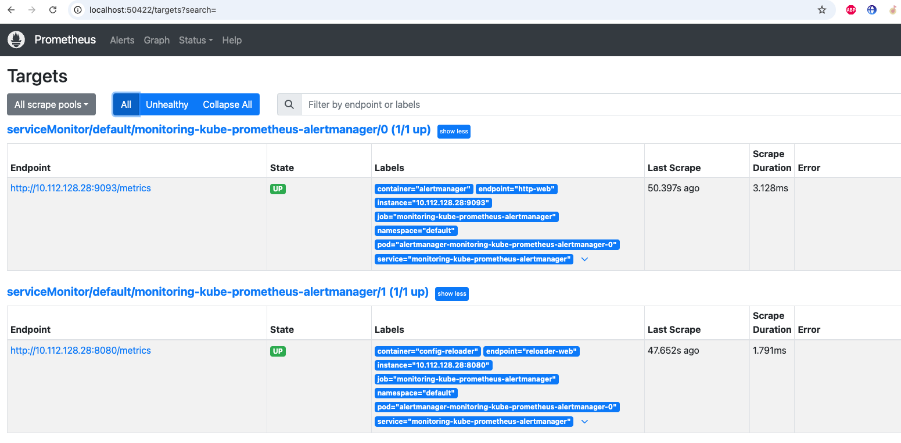

# ДЗ по курсу Otus MLOps

## Решение задания 10 - (Алертинг)

Несколько подов для модели


Сервер Prometheus



Метрики


Алертинг


Сработавший алерт


## Решение задания 8 - (Асинхронный потоковый режим , 33 урок)

* Producer: ```src/kafka_producer.py```
* Consumer: ```src/kafka_consumer.py```
* DAG: ```dags/run_model_inference.py```

Кафка в YC


Топики


Работа продюсера


Оценка интенсивности событий


Кластер обрабатывает около 4 тысяч транзакций в секунду, а источник генерировал около 25 тысяч транзакций. 

## Решение задания 9 - (обновление моделей, 37 урок)

* Приложение на fast api: ```src/app.py```
* Конфиги k8s: ```k8s/```
* Конфиг деплоймента: ```.github/workflows/main.yml```
* Пример пройденного пайплайна: https://github.com/zhukov-msu/otus-hw/actions/runs/11683116904

Секреты в репо

Кластер

Healthcheck


Предикт по внешнему API через port-forward


## Решение задания 6

* **DAG** находится здесь: ```dags/run_model_fit.py```. В нем мало что обновилось, т.к. я просто встроил в тот же submit ab-test 
* **Обучение модели:** ```src/model.py``` - добавлено бутстрапирование выборки, сравнение и логгирование метрики roc-auc, вычисление и логгирование p-value


## Решение задания 5

* **DAG** находится здесь: ```dags/run_model_fit.py```
* **Обучение модели:** ```src/model.py```


## Решение задания 4

* **DAG** находится здесь: ```dags/run_data_clean.py```


## Решение задания 3 (preprocessing)

* Запуск кластера: ```create_cluster.tf```
* Ноутбук препроцессинга: ```notebooks/hw3_data_preprocessing.ipynb```
* Запуск сабмита препроцессинга: ```spark-submit src/data_clean.py```
* Итоговый бакет: ```s3:///hw3-data-cleaning```


## Решение задачния 3.5 (по Feast)

### Получившийся Фичестор


### Код

* Использование стора: ```notebooks/hw35/feature_repo/hw3.5_feast.ipynb```
* Feature repo: ```notebooks/hw35/feature_repo/example_repo.py```

## Решение задания 2

### 1. terraform

Скрипт в ```main.tf```

### 2. S3 bucket

```s3://otus-hw-bucket``` доступен тут: https://console.yandex.cloud/folders/b1gmi1gs1575jti9jgnl/storage/buckets/otus-hw-bucket

### 3. dataproc

```main.tf```
```create_cluster.tf```

### 4. s3 -> hdfs


### 5. Стоимость

* cluster:
  * compute:
  7314*3+3750 = 25692
  * discs:
  373*3+116 = 1235
  * total:
  25692+1235 = 26927

* data storage:
  * ~ 150 в месяц
* Разница: hdfs дороже в 8 раз


## Решение задания 1

### 1. Сформулировать цели проектируемой антифрод-системы в соответствии с требованиями заказчика.
* Построить систему классификаций банковских транзакций
* Оценить необходимость внедрения ML-решения
* Реализовать поточную real-time обработку транзакций решением
### 2. Аргументированно выбрать метрику машинного обучения, оптимизация которой, на Ваш взгляд, позволит достичь поставленных целей.
* Основная метрика - F1-score.
* Обоснование:
  *  `Если система определит корректную транзакцию как мошенническую, эта транзакция будет отклонена, а пользователь будет недоволен. Опыт бизнес-аналитиков подсказывает, что если доля таких транзакций превысит 5 %, то начнется отток клиентов из компании.` по этой причине мы должны максимизировать **Precision**
  *  Мы должны максимизировать **Recall** по причине того, как мошеннические транзакции наносят ущерб компании, и мы не можем его снижать
  *  таким образом, мы должны балансировать между **Precision** и **Recall**, а для достижения этой цели мы можем использовать F1 - среднее гармоническое, которое не дает занижать ни одну из них
### 3. Проанализировать особенности проекта с использованием, например, MISSION Canvas. Это позволит выделить специфику проекта и формализовать требования к нему, подобрать инструментарий и критерии оценки.
Canvas доступен [по ссылке](https://docs.google.com/document/d/1BMTitj8REHeTk6tfza9Hl9mgKA2stgXscpTj7-QI0Ds/edit?usp=sharing) для комментирования
### 4. Попытаться декомпозировать планируемую систему, определить ее основные функциональные части.


### 5. Определить задачи, решение которых необходимо для достижения поставленных целей с учетом проведенного анализа. Задачи рекомендуется формулировать по принципу S.M.A.R.T. На текущий момент, пока не конкретизированы детали антифрод-системы, они могут быть представлены в достаточно общем виде. Но они позволят сформировать некоторый roadmap по реализации проекта.\

Задачи [здесь](https://github.com/users/zhukov-msu/projects/1)
